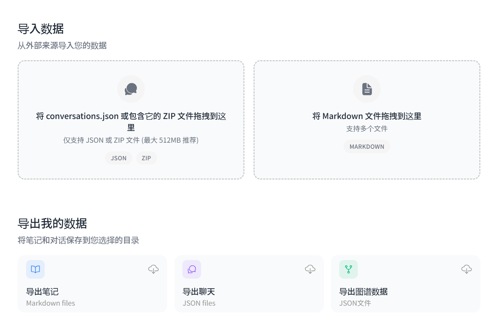
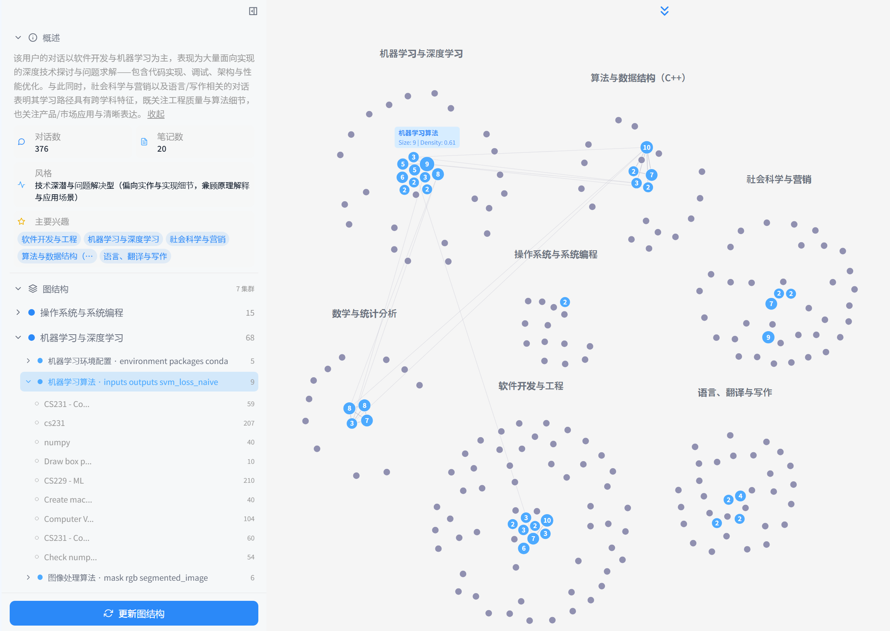
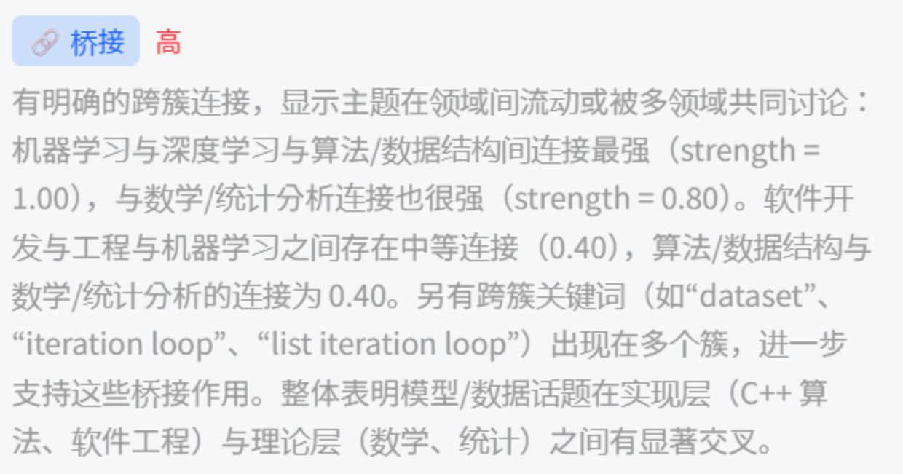
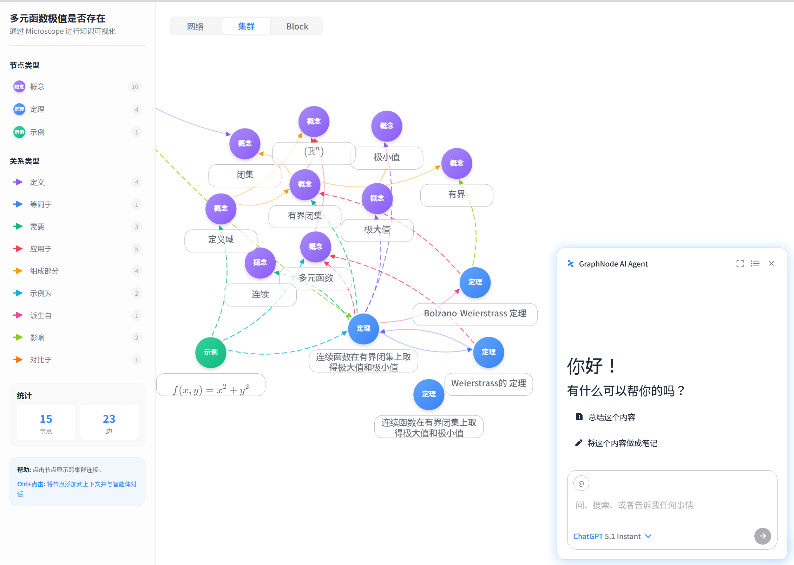
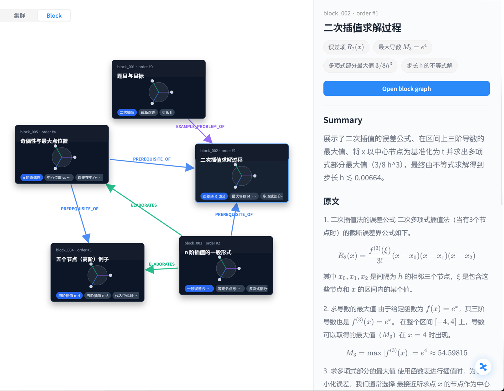
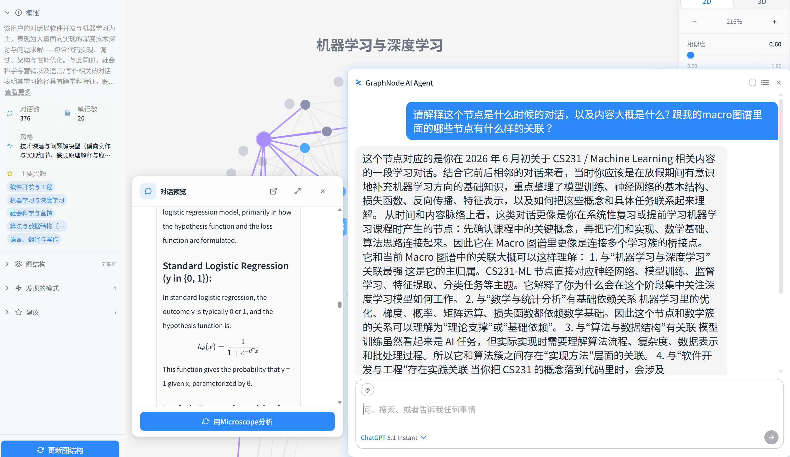
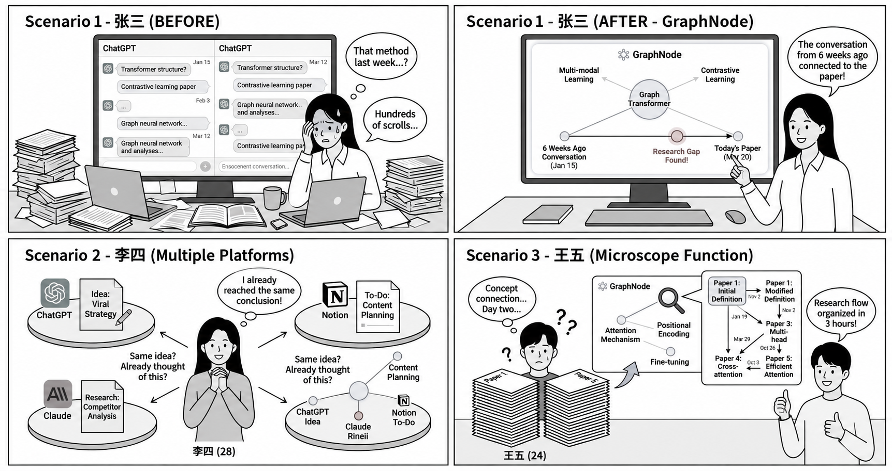

# 《大模型驱动的软件开发》课程最终报告

# GraphNode —— AI 时代的 Second Brain 知识图谱平台

> **由大语言模型（LLM）驱动的自动化知识结构化引擎**
>
> 学生：韩佑硕（2021080070） ｜ 邮箱：hanys21@mails.tsinghua.edu.cn ｜ 2026 春季学期

---

## 目录

1. 引言：AI 时代的知识悖论
2. 解决方案：GraphNode 概述
3. 系统架构与核心功能
   - 3.1 数据采集与沉淀层（图谱生成的源数据）
   - 3.2 知识结构化层（一）：Macro Graph 全局鸟瞰
   - 3.3 知识结构化层（二）：Microscope 单篇深挖
   - 3.4 交互层：GraphNode Agent（基于图谱的 RAG）
4. LLM 作为知识结构化引擎
5. 应用场景
6. 技术实现与工程要点
7. 项目现状与需求验证
8. 未来发展方向
9. 结论

---

## 1. 引言：AI 时代的知识悖论

近年来，以 ChatGPT、Claude、Gemini 为代表的大语言模型（LLM）迅速普及，深刻改变了知识工作者的日常。人们每天与 LLM 进行数十次对话，获取代码实现、概念解释、研究思路与方案设计。然而，一个尖锐的**悖论**随之浮现：**对话越聊越多，知识却没有真正增长。**

问题的根源在于：每一次对话所产生的深度洞见，往往在对话窗口关闭的瞬间便随之消散。信息以**碎片化、瞬时性**的状态被消费，难以沉淀为可被反复检索、关联与复用的长期知识资产。具体表现为如下图所示的若干典型困境：反复遗忘上周已解决的问题、信息散落在多个平台无法定位、习惯性地"开新对话重新搜索"、单次性地使用记录后便弃置、优质想法被埋入"知识坟场"，最终陷入"记录无限增长，而知识资产为零"的无底洞。

*图 1. 知识碎片化的六种典型困境：遗忘、信息分散、重复搜索、一次性使用、知识坟场与无底洞。*

在数字信息过载的背景下，相关调查显示信息工作者平均每天需花费约 3.6 小时用于搜索所需信息，且近 90% 的已获取信息会在一周内被遗忘。生成式 AI 的爆发式增长进一步放大了这一矛盾——数据产出指数级增加，但缺乏有效工具将其系统化整理与关联，大量信息停留在短暂消费的状态。本项目正是针对这一痛点而生。

---

## 2. 解决方案：GraphNode 概述

**GraphNode** 是一款"第二大脑（Second Brain）"平台。它能够**自动**分析用户与 AI 的对话记录以及个人笔记，并将其转化为以思维导图为结构的**交互式知识图谱**。与传统信息存储工具不同，GraphNode 不仅整理保存信息，更通过可视化方式呈现知识单元之间的关联关系，从而将转瞬即逝的信息转化为可持续积累、可导航的知识资产。

*图 2. 分散的记录经语义连接后，最终成为用户真正的"知识资产"；并实现跨平台（ChatGPT / Gemini / Claude / Notion）数据的统一结构化。*

GraphNode 的核心价值可归纳为三点：

- **知识连接（Connection）**：打破时间与平台的壁垒，将分散于 ChatGPT、Claude、Notion、Obsidian、Google Docs 等多处的知识整合为一张统一图谱。
- **洞察提炼（Insight）**：通过分析累积的图谱，发现重复模式、识别知识盲区，并提供个性化学习方向建议。
- **全流程自动化（Automation）**：由 LLM 自动分析对话语义、提取概念、构建关系并生成图谱，**无需用户手动打标**——这正是本项目"大模型驱动"的核心体现。

**市场定位。** 当前个人知识管理（PKM）市场呈两极分化：以 ChatGPT 为代表的生成式 AI 擅长信息生成，但无法跨对话构建知识关联；以 Obsidian、Logseq、Roam Research 为代表的知识管理工具虽提供图谱与双向链接，却高度依赖用户**手动**构建所有连接，使用门槛高、难以规模化。GraphNode 恰好位于二者的交汇点：通过 AI 自动构建语义关联，实现两类工具单独无法完成的能力整合。

---

## 3. 系统架构与核心功能

GraphNode 在功能上分为两大层次：**数据采集与沉淀层**（基础功能）与**知识结构化层**（核心功能）。前者负责把多源信息转化为统一的语义素材，后者由 LLM 驱动，将素材自动构建并持续更新为知识图谱。本节依次展开。

### 3.1 数据采集与沉淀层：图谱生成的源数据

该模块是 Macro / Micro 图谱的**源头（Source）**：所有对话与笔记都将作为知识图谱生成的原始素材。

**多源数据集成。** GraphNode 内置 AI 对话界面，支持 ChatGPT / Claude / Gemini 等多种 provider，同时支持从外部平台导入已有的对话历史与笔记（conversations.json / ZIP / Markdown），将散落各处的对话统一转化为可结构化的语义素材。

| | |
|:---:|:---:|
|  |  |
| *数据导入 / 导出界面（JSON / ZIP / Markdown）* | *内置多 provider 的 AI 对话界面* |

**笔记编辑器。** 除 AI 对话外，GraphNode 提供媲美 Notion / Obsidian 的流畅笔记编辑体验，支持 Markdown 语法、文本高亮、任务列表等扩展功能；并支持 **docx / PDF / pptx** 等多格式文档的查看与解析。在此沉淀的每一条笔记与文献，都是能够直接转化为 Macro / Micro 图谱核心节点的源数据。

| | |
|:---:|:---:|
|  |  |
| *支持高亮 / Markdown / 任务列表的笔记编辑器* | *PDF 查看器与内置 AI Agent* |

### 3.2 知识结构化层（一）：Macro Graph 全局鸟瞰

**Macro Graph** 分析用户的**全部**对话与笔记，生成一张全局知识鸟瞰图。其采用**三级层次结构**：

- **大聚类（Cluster）**：LLM 将全部对话按主题自动分类生成大聚类，如 "Machine Learning & Deep Learning"、"Algorithms & C++ Data Structures" 等。
- **子聚类（Sub-cluster）**：在大聚类内部按各节点的中心词进一步细分，共享多个中心词的节点被分为同一个子聚类。
- **节点（Node）**：代表单个对话或笔记；点击节点即可以悬浮窗形式查看对应内容。

此外，语义相似的节点之间会自动生成**边（Edge）**，帮助用户一目了然地把握知识脉络。

*图 3. Macro Graph：由 LLM 自动生成的全局知识鸟瞰图，呈现大聚类、子聚类、节点及节点间的语义边。*

**Graph Summary（图谱摘要）。** 在生成 Macro Graph 的同时，系统会对整体图谱进行分析，提供三类洞察：

- **模式识别（Pattern Recognition）**：检测反复出现的主题与枢纽对话；
- **空缺分析（Gap Analysis）**：识别尚未连接的知识领域与需要补充的学习盲区；
- **定制建议（Recommendation）**：推荐知识整合方向与学习路径。

| | |
|:---:|:---:|
|  |  |
| *模式识别报告* | *定制建议（如"将重复的积分／留数主题整理成统一手册"）* |

**Update Graph（动态更新）。** 完成新的 AI 对话或撰写新笔记后，点击 "Update Graph"，新内容会被 LLM 分析、判断其语义位置，并增量地添加到既有 Macro Graph 中——使知识图谱成为一个与用户**共同持续成长的动态资产**，而非一次性生成的静态快照。

### 3.3 知识结构化层（二）：Microscope 单篇深挖

如果说 Macro Graph 关注**多个对话/笔记之间**的关系，那么 **Microscope** 则聚焦于**单一文档内部**。当用户希望深入理解某条对话或某篇笔记的知识结构时（例如梳理课程笔记中的核心概念与依赖关系），可使用 Microscope 分析功能。它由 LLM 自动识别文档特征，从中提取 **node 与 edge**，将各概念之间的关系可视化为细粒度的知识图谱。Microscope 提供两种视图：

| | |
|:---:|:---:|
|  |  |
| *Cluster View（概念-关系微观图谱）* | *Block View（逻辑区块切分）* |

- **Cluster View**：更精细尺度的概念-关系微观图谱。节点按概念类型分为 Method、Theory、Concept、Formula、Tool 等；边按语义关系类型分为 defines、uses、applied_in、equivalent_to 等。
- **Block View**：将整篇文档切分为若干逻辑区块（block），并以 PREREQUISITE_OF、ELABORATES 等依赖关系连接，配合每个区块的摘要与原文，帮助用户快速把握全文逻辑脉络。

借助 Microscope，用户得以轻松获得对单篇文档的整体理解，把握该对话主要讨论了什么内容。

### 3.4 交互层：GraphNode Agent（基于图谱的 RAG）

GraphNode 的能力不止于可视化展示。在任意 Cluster / Macro / Micro 图谱中**点击节点**，即可唤起内置的 **GraphNode Agent**，基于该**图谱模块（Macro / Micro 节点）**进行 **RAG（检索增强生成）**问答。

与普通聊天机器人不同，GraphNode Agent 的回答不仅基于单轮对话，更**融合了 Macro Graph 中发现的模式（Pattern）与用户的学习倾向**，从而给出贴合**个人语境**的精准回答。例如：

- **【聚焦 Micro 图谱】** **Q：** "这个概念在文中的作用及其与其他概念的关联？" **A：** Agent 基于该文档的 Micro 概念网络，梳理上下游逻辑依赖与推导脉络，帮助快速吃透单篇文档结构。
- **【放眼 Macro 图谱】** **Q：** "这个节点与我既有的知识库、其他主题有何联系？" **A：** Agent 融合聚类分析，跨越时间与主题定位该节点的"知识坐标"，揭示其与其他知识簇之间的依赖与桥接关系，帮助用户俯瞰全局知识版图。

| | |
|:---:|:---:|
|  |  |
| *基于 Micro 图谱的单篇语境深挖* | *基于 Macro 图谱的跨主题关联解释* |

---

## 4. LLM 作为知识结构化引擎

本项目最契合《大模型驱动的软件开发》课程主题之处在于：**LLM 并非系统的一个附加功能，而是贯穿整个软件的"知识结构化引擎（Knowledge-Structuring Engine）"。** 软件的每一个核心环节都由大模型驱动，如下表所示。

| 功能 | LLM 角色 | 输出 |
|---|---|---|
| Macro Graph 生成 | 主题分析、关键词提取、自动聚类标注 | 层次化全局知识图谱 |
| Graph Summary | 分析整体图谱模式并提炼洞察 | 模式 / 空缺 / 建议报告 |
| Update Graph | 判断新对话/笔记的语义位置 | 实时图谱更新 |
| Micro Graph 生成 | 提取单篇文档内的概念-关系 | 细粒度概念知识图谱 |
| Agent Chat（RAG） | 以 Macro / Micro 模块为上下文问答 | 基于语境的精准回答 |

*表 1. LLM 在 GraphNode 各核心环节中扮演的角色。*

从软件工程的视角看，这种"以 LLM 为核心引擎"的架构带来了开发范式的转变：传统上需要手写复杂规则与启发式算法才能完成的"信息聚类、关系抽取、主题命名"等任务，如今通过**精心设计的提示词（Prompt）与结构化输出约束**即可由大模型完成。开发者的工作重心从"编写规则"转向"设计提示、约束输出格式、校验与回退（fallback）机制"，这正是大模型驱动软件开发的典型特征。

---

## 5. 应用场景 Use Cases

为说明 GraphNode 的实际价值，下面给出三个典型使用场景。

*图 4. 三类真实使用场景：跨时间连接、跨平台整合与 Microscope 深度解析。*

- **场景一——跨时间连接（缝合知识断层）：** 在数百条 ChatGPT 对话中，GraphNode 自动将"6 周前的历史灵感"与"今天的文献"建立图谱连线，帮助用户精准找回失落的上下文语境。
- **场景二——跨平台整合（打破信息孤岛）：** 用户在 ChatGPT、Claude 与 Notion 上产生的同源想法被统一映射到一张知识网络中，避免"我是不是早就想到过这个"式的重复劳动。
- **场景三——Microscope 深度解析（重塑研究脉络）：** 将繁杂的课程笔记中的核心概念（如 Attention、Positional Encoding 等）及其关系，在数小时内自动结构化为清晰的研究脉络。

---

## 6. 技术实现与工程要点

### 6.1 自研八阶段 AI 流水线

GraphNode 的核心是一条自研的**八阶段 AI 流水线**，实现从原始文本到知识图谱的端到端自动化，其概念流程为：

> 特征提取（embedding） → 语义聚类 → 关键词/主题命名 → 关系（边）构建 → 层次化（Cluster/Sub-cluster） → 图谱后处理 → 摘要与洞察 → 向量索引（供 RAG 检索）

其中聚类与边构建综合使用了嵌入向量的余弦相似度、社区发现（如 Louvain）等方法，而命名、摘要、关系类型判定等语义任务则交由 LLM 完成。流水线对多语言（中／英／韩）语义理解进行了优化，支持跨语言的知识关联构建。

### 6.2 分层式知识结构设计

系统采用三层结构体系：**Workspace → Cluster → Node**，能够适配从个人笔记到组织级知识库的不同规模，实现高效的信息管理与检索。

### 6.3 跨平台与多格式支持

在数据接入侧，系统支持 ChatGPT / Claude / Gemini 等对话历史的导入，以及 docx / PDF / pptx / Markdown 等多格式文档的解析；在数据流转侧，规划通过 MCP（Model Context Protocol）等机制与飞书、Notion、Obsidian 等外部平台同步，打造真正意义上的跨平台知识枢纽。

---

## 7. 项目现状与需求验证

**已完成。** 核心**八阶段 AI 流水线**已实现；Macro Graph、Microscope、Update Graph、Graph Summary 与 GraphNode Agent 等功能均可运行；并已完成与 **Notion** 的同步。

**需求验证。** 项目通过对清华大学与北京大学留学生的问卷调研验证了真实需求：

- **69.2%** 的受访者将"难以找回过往笔记的上下文"视为现有工具的最大痛点；
- **100%** 的受访者将"学习与研究整理"作为核心使用场景；
- **92.3%** 的受访者将"知识可视化"视为最期待的功能。

这些数据与本项目所解决的核心问题高度吻合。

**进行中。** MVP 计划于 2026 年正式上线；相关知识产权（专利及软件著作权）正在申请准备中。

---

## 8. 未来发展方向

### 8.1 GraphNode Agent 升级为"配速员（Pace-maker）"

目前 Agent 主要响应用户的查询。未来计划让 Agent 主动结合用户**最近的对话、提问情境与目标**（如备考、考研、面试准备等），充当并肩同行的"配速员"，提供主动式陪伴与学习进度导航。其回答不仅基于对话，更能调用已生成的 **Macro / Micro 节点模块**进行 RAG，给出贴合个人语境的精准引导。

### 8.2 Agentic Knowledge Management

将目前相互独立的功能（Macro 生成、Update、Microscope 分析）整合为**统一的 AI Agent 工作流**。例如，当用户说"帮我整理上个月关于机器学习的对话"时，Agent 将自动完成：检索相关节点 → Macro 聚类 → 对关键节点应用 Microscope 分析 → 生成综合摘要与知识空缺报告，全程由 Agent 主动判断并自动执行。

### 8.3 多模态输入与跨平台扩展

目前主要聚焦于文本型对话与笔记，未来计划处理图片、PDF、课程视频等多模态输入，构建更丰富的知识图谱；同时在已跑通 Notion 同步的基础上，进一步深度接入 Obsidian、飞书（Feishu）等主流生产力工具，满足用户在现有工作流中无缝使用的需求。

---

## 9. 结论

本报告系统阐述了 GraphNode ——一个由大语言模型驱动的"第二大脑"知识图谱平台。针对 AI 时代"对话越聊越多、知识却没有增长"的核心悖论，GraphNode 以 LLM 作为贯穿全局的知识结构化引擎，通过**数据采集、Macro 全局图谱、Microscope 单篇深挖、Agent 图谱问答**四大能力，将碎片化、瞬时性的信息自动转化为可持续积累、可导航的知识资产。

从《大模型驱动的软件开发》课程的视角看，本项目展示了一种新的软件构建范式：**把传统上依赖手写规则的复杂语义任务交由大模型完成**，开发者通过提示设计、输出约束与回退机制来组织系统行为。这不仅显著降低了用户的使用门槛（无需手动构建知识连接），也为"AI 原生（AI-native）"应用的设计提供了一个可参考的实践样本。
