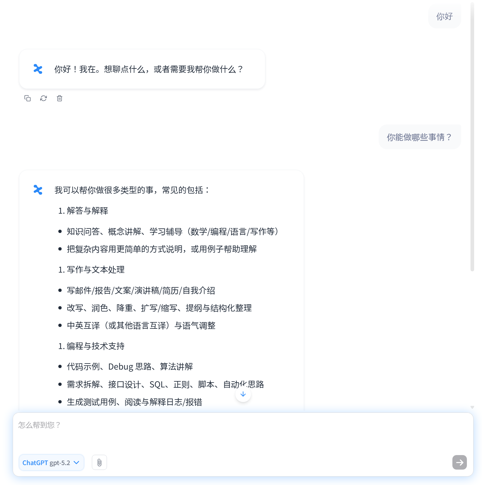
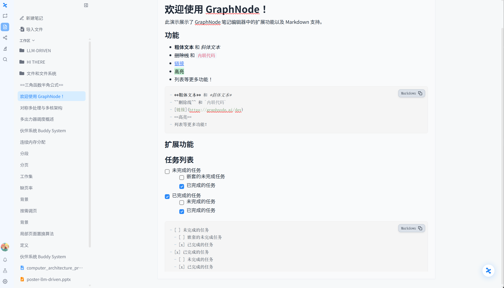
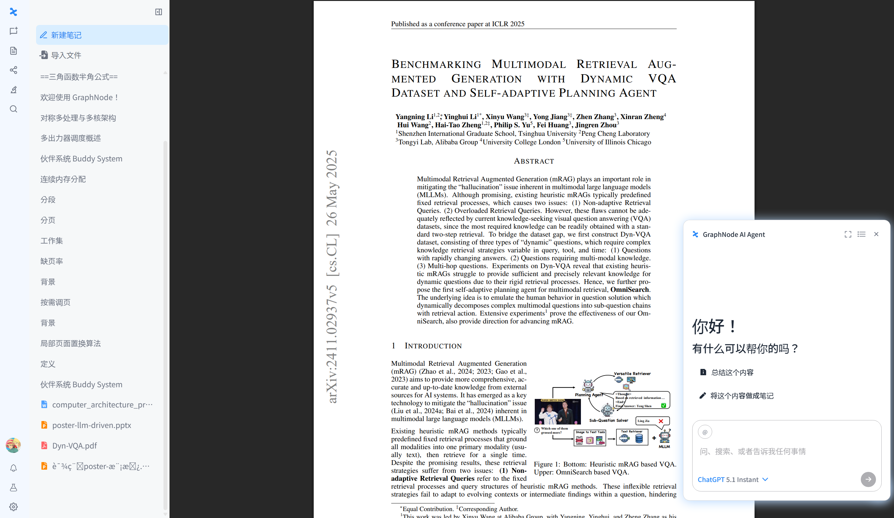
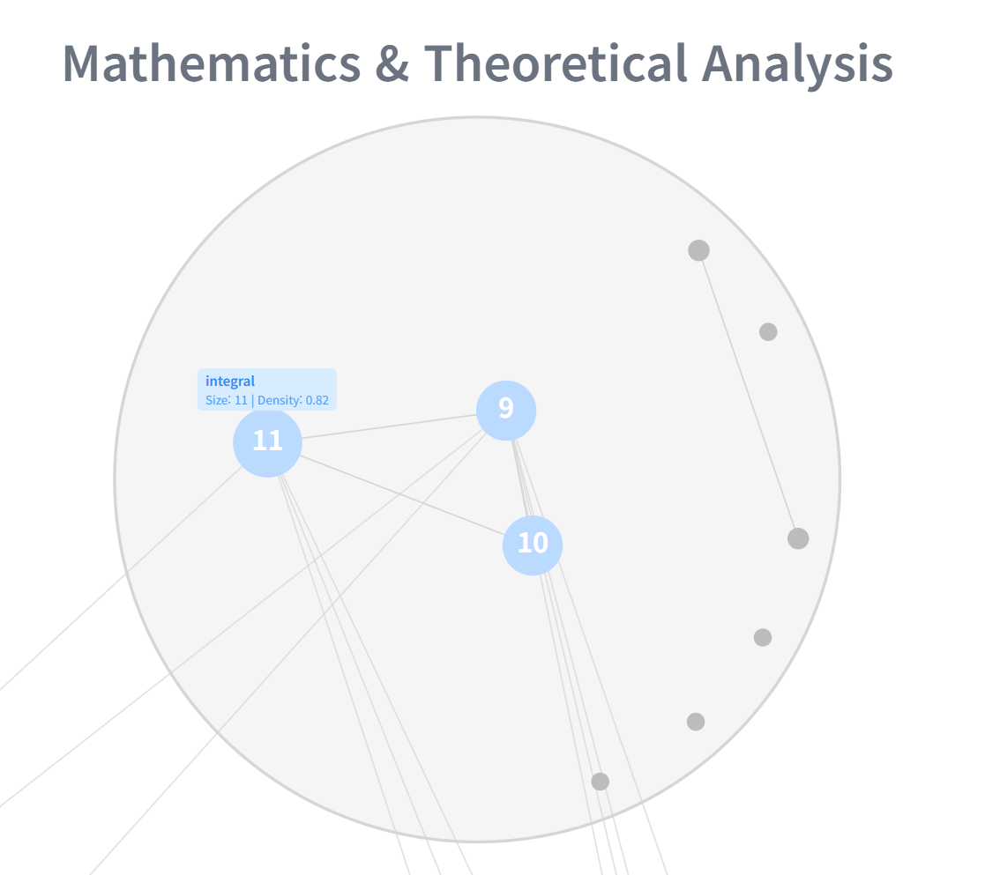
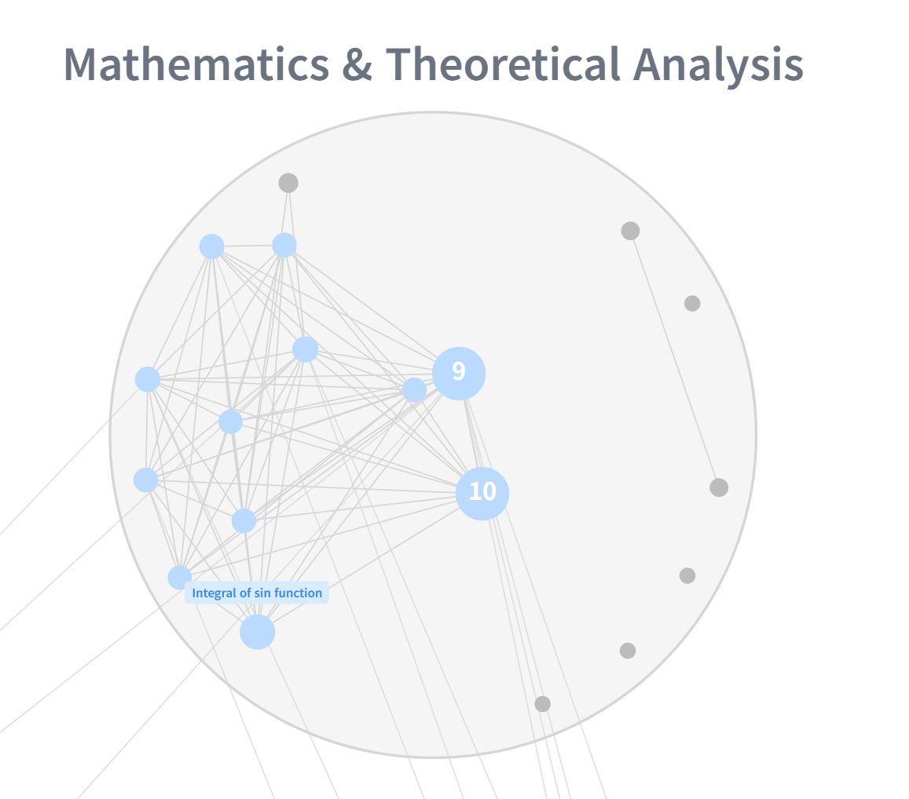
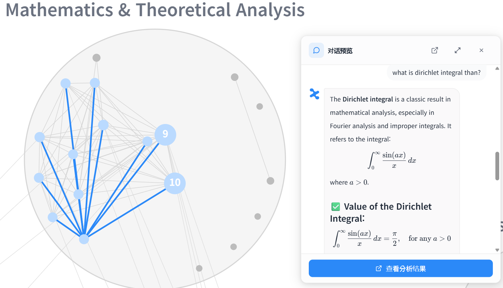
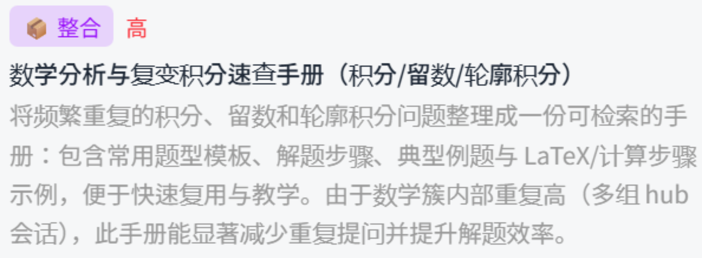
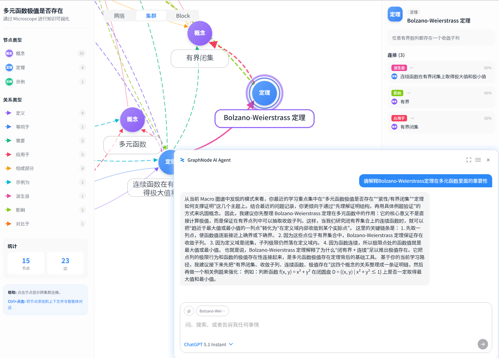

# 《大模型驱动的软件开发》课程最终报告

# GraphNode —— AI 时代的 Second Brain 知识图谱平台

# 目录

1. 引言：AI 时代的知识悖论
2. 解决方案：GraphNode 
3. 系统架构与核心功能
   - 3.1 数据采集与沉淀层
   - 3.2 知识结构化层（一）：Macro Graph 
   - 3.3 知识结构化层（二）：Microscope 
   - 3.4 交互层：GraphNode Agent
4. LLM用处
5. 应用场景
6. 技术实现与工程要点
7. 项目现状
8. 未来发展方向
9. 结论

---

## 1. 引言：AI 时代的知识悖论

近年来，以 ChatGPT、Claude、Gemini 为代表的大语言模型（LLM）迅速普及，深刻改变了知识工作者的日常。人们每天与 LLM 进行数十次对话，获取代码实现、概念解释、研究思路与方案设计。然而，一个尖锐的**悖论**随之浮现：**对话越聊越多，知识却没有真正增长。**

问题的根源在于：每一次对话所产生的深度洞见，往往在对话窗口关闭的瞬间便随之消散。信息以**碎片化、瞬时性**的状态被消费，难以沉淀为可被反复检索、关联与复用的长期知识资产。具体表现为如下图所示的若干典型困境：反复遗忘上周已解决的问题、信息散落在多个平台无法定位、习惯性地"开新对话重新搜索"、单次性地使用记录后便弃置、优质想法被埋入"知识坟场"，最终陷入"记录无限增长，而知识资产为零"的无底洞。


*图 1. 知识碎片化的过程：从反复遗忘、信息散落到重复检索与一次性复用，最终导致知识沉没与价值流失。*

在数字信息过载的背景下，相关调查显示信息工作者平均每天需花费约 **3.6 小时**用于搜索所需信息<sup>[1]</sup>；与此同时，认知科学的经典研究表明，未经复习的信息会快速衰减——遗忘曲线显示其在 24 小时后约只剩三分之一、6 天后约只剩四分之一<sup>[2]</sup>。生成式 AI 的爆发式增长进一步放大了这一矛盾——数据产出指数级增加，但缺乏有效工具将其系统化整理与关联，大量信息停留在短暂消费的状态。本项目正是针对这一痛点而生（数据来源见**附录 C**）。

---

## 2. 解决方案：GraphNode 

**GraphNode** 是一款"第二大脑（Second Brain）"平台。它能够**自动**分析用户与 AI 的对话记录以及个人笔记，并将其转化为以思维导图形式的**交互式知识图谱**。

与传统信息存储工具不同，GraphNode 不仅整理保存信息，更通过可视化方式呈现知识单元之间的关联关系，从而将转瞬即逝的信息转化为可持续积累、可导航的知识资产。


*图 2. 分散的记录经语义连接后，最终成为用户真正的"知识资产"；并实现跨平台（ChatGPT / Gemini / Claude / Notion）数据的统一结构化。*

GraphNode 的核心价值可归纳为三点：

- **知识连接（Connection）**：打破时间与平台的壁垒，将分散于 ChatGPT、Claude、Notion、Obsidian、Google Docs 等多处的知识整合为一张统一图谱。
- **洞察提炼（Insight）**：通过分析累积的图谱，发现重复模式、识别知识盲区，并提供个性化学习方向建议。
- **全流程自动化（Automation）**：由 LLM 自动分析对话语义、提取概念、构建关系并生成图谱，**无需用户手动打标**——这正是本项目"大模型驱动"的核心体现。

**市场定位。** 当前个人知识管理（PKM）市场呈两极分化：以 ChatGPT 为代表的生成式 AI 擅长信息生成，但无法跨对话构建知识关联；以 Obsidian、Logseq、Roam Research 为代表的知识管理工具虽提供图谱与双向链接，却高度依赖用户**手动**构建所有连接，使用门槛高、难以规模化。GraphNode 恰好位于二者的交汇点：通过 AI 自动构建语义关联，实现两类工具单独无法完成的能力整合。

---

## 3. 系统架构与核心功能

GraphNode 在功能上分为三大层次：**数据采集与沉淀层**（基础功能）、**知识结构化层**与**交互层**（核心功能）。第一层负责把多源信息转化为统一的语义素材；第二层由 LLM 驱动，将素材自动构建并持续更新为知识图谱；第三层则让用户基于图谱进行 RAG 问答与探索。本节依次展开。

### 3.1 数据采集与沉淀层：图谱生成的源数据

该模块是 Macro / Micro 图谱的**源头（Source）**：所有对话与笔记都将作为知识图谱生成的原始素材。

**多源数据集成。** GraphNode 内置 AI 对话界面，支持 ChatGPT / Claude / Gemini 等多种 provider，同时支持从外部平台导入已有的对话历史与笔记（Json / ZIP / Markdown），将散落各处的对话统一转化为可结构化的语义素材。

| | |
|:---:|:---:|
|  |  |
| *数据导入 / 导出界面（JSON / ZIP / Markdown）* | *内置多 provider 的 AI 对话界面* |

**笔记编辑器。** 除 AI 对话外，GraphNode 提供媲美 Notion / Obsidian 的流畅笔记编辑体验，支持 Markdown 语法、文本高亮、任务列表等扩展功能；还支持 **docx / PDF / pptx** 等多格式文档的查看与解析。在此沉淀的每一条笔记与文献，都是能够直接转化为 Macro / Micro 图谱核心节点的源数据。

| | |
|:---:|:---:|
|  |  |
| *支持高亮 / Markdown / 任务列表的笔记编辑器* | *PDF 查看器与内置 AI Agent* |

### 3.2 知识结构化层（一）：Macro Graph 全局鸟瞰

**Macro Graph** 分析用户的**全部**对话与笔记，生成一张全局知识鸟瞰图。其采用**三级层次结构**：

- **大聚类（Cluster）**：LLM 将全部对话按主题自动分类生成大聚类，如 "Machine Learning & Deep Learning"、"Algorithms & C++ Data Structures" 等。
- **子聚类（Sub-cluster）**：在大聚类内部按各节点的中心词进一步细分，共享多个中心词的节点被分为同一个子聚类。
- **节点（Node）**：代表单个对话或笔记；点击节点即可以悬浮窗形式查看对应内容。

此外，语义相似的节点之间会自动生成**边（Edge）**，帮助用户一目了然地把握知识脉络。


*图 3. Macro Graph：由 LLM 自动生成的全局知识鸟瞰图，呈现大聚类、子聚类、节点及节点间的语义边。*

**子聚类的展开与下钻。** 在大聚类内部，子聚类初始以聚合形式呈现（每个子聚类显示其规模与内部密度）；展开后即可看到子聚类内部的各个节点及其连边，实现从"全局鸟瞰"到"局部细节"的逐级下钻。

| | |
|:---:|:---:|
|  |  |
| *图 4-1. 子聚类（展开前）：以聚合节点呈现，标注规模与密度* | *图 4-2. 子聚类（展开后）：显示内部各节点及连边* |

**节点交互。** 点击任意节点，即以悬浮窗形式查看该节点对应的内容，并可直接对该节点发起基于图谱的问答（见 3.4）。


*图 5. 点击节点后弹出的悬浮窗：查看节点内容并发起问答。*

**Graph Summary（图谱摘要）。** 在生成 Macro Graph 的同时，系统会对整体图谱进行分析，提供两类洞察：

- **模式识别（Pattern Recognition）**：检测反复出现的主题与枢纽对话；
- **定制建议（Recommendation）**：推荐知识整合方向与学习路径。

| | |
|:---:|:---:|
|  |  |
| *用户模式识别* | *定制建议（如"将重复的积分／留数主题整理成统一手册"）* |

**Update Graph（动态更新）。** 完成新的 AI 对话或撰写新笔记后，点击 "Update Graph"，新内容会被 LLM 分析、判断其语义位置，并增量地添加到已有的 Macro Graph 中——使知识图谱成为一个与用户**共同持续成长的动态资产**，而非一次性生成的静态快照。

### 3.3 知识结构化层（二）：Microscope 单篇深挖

如果说 Macro Graph 关注**多个对话/笔记之间**的关系，那么 **Microscope** 则聚焦于**单一文档内部**。当用户希望深入理解某条对话或某篇笔记的知识结构时（例如梳理课程笔记中的核心概念与依赖关系），可使用 Microscope 分析功能。它由 LLM 自动识别文档特征，从中提取 **node 与 edge**，将各概念之间的关系可视化为细粒度的知识图谱。Microscope 提供两种视图：

| | |
|:---:|:---:|
|  |  |
| *Cluster View（概念-关系微观图谱）* | *Block View（逻辑区块切分）* |

- **Cluster View**：更精细尺度的概念-关系微观图谱。节点与边并非任意生成，而是依照**预定义的本体 Schema** 中所规定的 node 类型与 edge 类型进行抽取——LLM 严格在 Schema 允许的类型范围内识别概念及其语义关系（Schema 的具体定义与所用 Prompt 见**附录 A.2.1**）。
- **Block View**：将整篇文档切分为若干逻辑区块（block），并以区块间的依赖关系相连，配合每个区块的摘要与原文，帮助用户快速把握全文逻辑脉络。

借助 Microscope，用户得以轻松获得对单篇文档的整体理解，把握该对话主要讨论了什么内容。

### 3.4 交互层：GraphNode Agent（基于图谱的 RAG）

GraphNode 的能力不止于可视化展示。在任意 Cluster / Macro / Micro 图谱中**点击节点**，即可唤起内置的 **GraphNode Agent**，基于该**图谱模块（Macro / Micro 节点）**进行 **RAG（检索增强生成）**问答。

与普通聊天机器人不同，GraphNode Agent 的回答不仅基于单轮对话，更**融合了 Macro Graph 中发现的模式（Pattern）与用户的学习倾向**，从而给出贴合**个人语境**的精准回答。例如：

- **【聚焦 Micro 图谱】** **Q：** "这个概念在文中的作用及其与其他概念的关联？" **A：** Agent 基于该文档的 Micro 概念网络，梳理上下游逻辑依赖与推导脉络，帮助快速吃透单篇文档结构。
- **【放眼 Macro 图谱】** **Q：** "这个节点与我既有的知识库、其他主题有何联系？" **A：** Agent 融合聚类分析，跨越时间与主题定位该节点的"知识坐标"，揭示其与其他知识簇之间的依赖与桥接关系，帮助用户俯瞰全局知识版图。

| | |
|:---:|:---:|
|  |  |
| *基于 Micro 图谱的单篇语境深挖* | *基于 Macro 图谱的跨主题关联解释* |

---

## 4. LLM 作为知识结构化引擎

本项目最契合《大模型驱动的软件开发》课程主题之处在于：**LLM 并非系统的一个附加功能，而是贯穿整个软件的"知识结构化引擎（Knowledge-Structuring Engine）"。** 软件的每一个核心环节都由大模型驱动，如下表所示。

| 功能 | LLM 角色 | 输出 |
|---|---|---|
| Macro Graph 生成 | 主题分析、关键词提取、自动聚类标注 | 层次化全局知识图谱 |
| Graph Summary | 分析整体图谱模式并提炼洞察 | 模式 / 空缺 / 建议报告 |
| Update Graph | 判断新对话/笔记的语义位置 | 实时图谱更新 |
| Micro Graph 生成 | 提取单篇文档内的概念-关系 | 细粒度概念知识图谱 |
| Agent Chat（RAG） | 以 Macro / Micro 模块为上下文问答 | 基于语境的精准回答 |

*表 1. LLM 在 GraphNode 各核心环节中扮演的角色。*

从软件工程的视角看，这种"以 LLM 为核心引擎"的架构带来了开发范式的转变：传统上需要手写复杂规则与启发式算法才能完成的"信息聚类、关系抽取、主题命名"等任务，如今通过**精心设计的提示词（Prompt）与结构化输出约束**即可由大模型完成。开发者的工作重心从"编写规则"转向"设计提示、约束输出格式、校验与回退（fallback）机制"，这正是大模型驱动软件开发的典型特征。

---

## 5. 应用场景 Use Cases

为说明 GraphNode 的实际价值，下面给出三个典型使用场景。


*图 6. 三类真实使用场景：跨时间连接、跨平台整合与 Microscope 深度解析。*

- **场景一——跨时间连接（缝合知识断层）：** 在数百条 ChatGPT 对话中，GraphNode 自动将"6 周前的历史灵感"与"今天的文献"建立图谱连线，帮助用户精准找回失落的上下文语境。
- **场景二——跨平台整合（打破信息孤岛）：** 用户在 ChatGPT、Claude 与 Notion 上产生的同源想法被统一映射到一张知识网络中，避免"我是不是早就想到过这个"式的重复劳动。
- **场景三——Microscope 深度解析（重塑研究脉络）：** 将繁杂的课程笔记中的核心概念（如 Attention、Positional Encoding 等）及其关系，在数小时内自动结构化为清晰的研究脉络。

---

## 6. 技术实现与工程要点

### 6.1 自研八阶段 AI 流水线

GraphNode 的核心是一条自研的**八阶段 AI 流水线**，实现从原始文本到知识图谱的端到端自动化，其概念流程为：

> 特征提取（embedding） → 语义聚类 → 关键词/主题命名 → 关系（边）构建 → 层次化（Cluster/Sub-cluster） → 图谱后处理 → 摘要与洞察 → 向量索引（供 RAG 检索）

其中聚类与边构建综合使用了嵌入向量的余弦相似度、社区发现（如 Louvain）等方法，而命名、摘要、关系类型判定等语义任务则交由 LLM 完成。流水线对多语言（中／英／韩）语义理解进行了优化，支持跨语言的知识关联构建。

### 6.2 分层式知识结构设计

系统采用三层结构体系：**Workspace → Cluster → Node**，能够适配从个人笔记到组织级知识库的不同规模，实现高效的信息管理与检索。

### 6.3 跨平台与多格式支持

在数据接入侧，系统支持 ChatGPT / Claude / Gemini 等对话历史的导入，以及 docx / PDF / pptx / Markdown 等多格式文档的解析；在数据流转侧，规划通过 MCP（Model Context Protocol）等机制与飞书、Notion、Obsidian 等外部平台同步，打造真正意义上的跨平台知识枢纽。

---

## 7. 项目现状与需求验证

**已完成。** 核心**八阶段 AI 流水线**已实现；Macro Graph、Microscope、Update Graph、Graph Summary 与 GraphNode Agent 等功能均可运行；并已完成与 **Notion** 的同步。

**需求验证。** 项目通过对清华大学与北京大学留学生的问卷调研验证了真实需求：

- **69.2%** 的受访者将"难以找回过往笔记的上下文"视为现有工具的最大痛点；
- **100%** 的受访者将"学习与研究整理"作为核心使用场景；
- **92.3%** 的受访者将"知识可视化"视为最期待的功能。

这些数据与本项目所解决的核心问题高度吻合。

**进行中。** MVP 计划于 2026 年正式上线；相关知识产权（专利及软件著作权）正在申请准备中。

---

## 8. 未来发展方向

### 8.1 GraphNode Agent 升级为"配速员（Pace-maker）"

目前 Agent 主要响应用户的查询。未来计划让 Agent 主动结合用户**最近的对话、提问情境与目标**（如备考、考研、面试准备等），充当并肩同行的"配速员"，提供主动式陪伴与学习进度导航。其回答不仅基于对话，更能调用已生成的 **Macro / Micro 节点模块**进行 RAG，给出贴合个人语境的精准引导。

### 8.2 Agentic Knowledge Management

将目前相互独立的功能（Macro 生成、Update、Microscope 分析）整合为**统一的 AI Agent 工作流**。例如，当用户说"帮我整理上个月关于机器学习的对话"时，Agent 将自动完成：检索相关节点 → Macro 聚类 → 对关键节点应用 Microscope 分析 → 生成综合摘要与知识空缺报告，全程由 Agent 主动判断并自动执行。

### 8.3 多模态输入与跨平台扩展

目前主要聚焦于文本型对话与笔记，未来计划处理图片、PDF、课程视频等多模态输入，构建更丰富的知识图谱；同时在已跑通 Notion 同步的基础上，进一步深度接入 Obsidian、飞书（Feishu）等主流生产力工具，满足用户在现有工作流中无缝使用的需求。

---

## 9. 结论

本报告系统阐述了 GraphNode ——一个由大语言模型驱动的"第二大脑"知识图谱平台。针对 AI 时代"对话越聊越多、知识却没有增长"的核心悖论，GraphNode 以 LLM 作为贯穿全局的知识结构化引擎，通过**数据采集、Macro 全局图谱、Microscope 单篇深挖、Agent 图谱问答**四大能力，将碎片化、瞬时性的信息自动转化为可持续积累、可导航的知识资产。

从《大模型驱动的软件开发》课程的视角看，本项目展示了一种新的软件构建范式：**把传统上依赖手写规则的复杂语义任务交由大模型完成**，开发者通过提示设计、输出约束与回退机制来组织系统行为。这不仅显著降低了用户的使用门槛（无需手动构建知识连接），也为"AI 原生（AI-native）"应用的设计提供了一个可参考的实践样本。

---

# 附录 A：核心模块实现详解

> 本附录面向**源码审阅**：说明 Macro、Microscope、RAG 三大模块在所提交源码（`GraphNode_AI/`）中的具体实现位置、关键数据结构，以及实际使用的提示词（Prompt）。正文为整体介绍，本附录为"看哪段代码、用了什么 Prompt"的索引。
>
> 所有路径均相对于源码根目录 `GraphNode_AI/`。

## A.1 Macro Graph 实现

Macro 是一条**多阶段流水线**，入口为 `macro/src/run_pipeline.py`（`main()` 顺序编排 Step 1–7）。各阶段以独立脚本实现，便于单独调试。

| 阶段 | 功能 | 代码位置 |
|---|---|---|
| Step 1 | 嵌入提取 + 关键词提取 | `macro/src/extract_features.py` |
| Step 2 | LLM 聚类（大聚类生成 + 节点分配） | `macro/src/cluster_with_llm.py` |
| Step 3 | 边（Edge）构建 | `macro/src/build_edges.py` |
| Step 4–5 | 合并 + 后处理 | `macro/src/merge_graph.py`, `util/postprocess_json.py` |
| Step 6 | 子聚类（中分类）生成 | `macro/src/build_subclusters.py` |
| Step 7 | 嵌入索引（供 RAG/macro 检索） | `macro/src/insights/index_embeddings.py` |
| 附加 | 图谱摘要 / 用户分析 | `macro/src/insights/`（`summarize.py`, `discovery/graph_summarizer.py`） |

### A.1.1 嵌入提取与关键词提取（Step 1）

**代码：** `macro/src/extract_features.py`；配置：`macro/config.yaml`。

- **嵌入（Embedding）：** 使用 `sentence-transformers` 的多语言模型 `paraphrase-multilingual-MiniLM-L12-v2`（384 维），对每条对话/笔记编码为语义向量（`load_embedding_model`）。
- **关键词（Keyword）：** 使用 **KeyBERT**（`extract_keywords`）基于嵌入相似度抽取关键短语，配合去重（`deduplicate_keywords`，token 集合 Jaccard + 阈值 `dedup_thresh: 0.8`）。配置见 `config.yaml`：

```yaml
embedding_model: sentence-transformers/paraphrase-multilingual-MiniLM-L12-v2
keyword:
  top_n: 5          # 每篇取 Top-5 关键词
  max_ngram: 3      # 1~3 元短语
  dedup_thresh: 0.8 # 去重阈值
preprocess:
  stopwords_langs: [en, zh, ko]  # 多语言停用词
```

### A.1.2 LLM 聚类：大聚类生成与节点分配（Step 2）

**代码：** `macro/src/cluster_with_llm.py`（`LLMClusteringClient`）。分两步，均由 LLM 完成：

**① 大聚类生成**（`generate_clusters`）——把全部对话的关键词喂给 LLM，让其自行决定 3–8 个主题聚类并命名。实际 Prompt（节选）：

```
System: You are an expert at analyzing conversation topics and creating
meaningful clusters. Return ONLY valid JSON ... {language_instruction}

User: Analyze these {N} conversations and their extracted keywords.
Determine the optimal number of clusters between {min} and {max} ...
Requirements:
- Each cluster should represent a distinct topic/domain
- Cluster names should be clear and descriptive (2-5 words)
- Identify 3-5 key themes/terms for each cluster
Return ONLY valid JSON: { "num_clusters":3, "clusters":[ {id,name,description,key_themes} ] }
```

**② 节点分配**（批处理，`assign_conversations`）——把每条对话分配到最合适的聚类，并给出置信度。为稳健性使用**纯文本管道格式**而非 JSON（更难被截断），并对未分配项自动重试（最多 10 次）。实际 Prompt（节选）：

```
System: ... For each conversation output exactly one line formatted as
'conversation_id=<ID> | cluster_id=<CLUSTER_ID> | confidence=<0.00-1.00>'.

User: Assign each conversation to the most appropriate cluster.
Available Clusters: {clusters_json}
Conversations to Assign: {id + keywords}
- Base assignment on keyword relevance to cluster themes
- Produce exactly {N} lines, one per conversation ID
```

> 输出语言由 `get_language_instruction(language)` 控制（`insights/discovery/prompts/summarizer_prompts.py`），支持中/英/韩聚类命名。

### A.1.3 边构建（Step 3）

**代码：** `macro/src/build_edges.py`。基于节点嵌入的**余弦相似度**，按 `high-threshold` / `medium-threshold` 两级阈值生成节点间的语义边（`config.yaml` 中 `graph.sim_top_k: 5`），从而把孤立节点连成知识网络。

### A.1.4 子聚类 / 中分类（Step 6）

**代码：** `macro/src/build_subclusters.py`。在每个大聚类内部，基于节点-节点相似度子图运行 **Louvain 社区发现**（`detect_communities_louvain`，`resolution` 可调），把共享中心词的节点划入同一子聚类；`extract_top_keywords` 抽取子聚类的代表关键词（`top_keywords[0]` 作为中分类显示名）；`find_representative_node` 选代表节点。随后由 Step 6.5（`run_pipeline.py`）把 `subcluster_id` 回填到每个节点。

### A.1.5 图谱摘要与用户分析（Graph Summary）

**代码：** `macro/src/insights/`，入口 `summarize.py` → `discovery/graph_summarizer.py`，数据结构 `discovery/schema.py`（`GraphSummary`）。产物为 `summary.json`，包含：

- `OverviewSection`：`primary_interests`、`conversation_style`（学习风格）、`summary_text`
- `Pattern`：跨图谱模式（`repetition`/`progression`/`gap` + `significance`）
- `Recommendation`：可执行建议（`consolidate`/`explore`/`review`/`connect` + `priority`）

提示词位于 `discovery/prompts/summarizer_prompts.py`，含 `OVERVIEW_PROMPT`（用户兴趣与风格）、`PATTERN_DETECTION_PROMPT`（模式识别）、`RECOMMENDATION_PROMPT`（建议生成）。例如 `OVERVIEW_PROMPT`（节选）：

```
You are analyzing a knowledge graph built from a user's LLM conversation history.
## Graph Statistics  Total conversations / clusters / time span / top clusters
## Output Format (JSON)
{ "primary_interests":[...], "conversation_style":"e.g. 기술 심화형 / 탐색형",
  "most_active_period":..., "summary_text":"2-3 sentence summary" }
```

> **这份 `summary.json` 正是 A.3.2 中 RAG 个性化所"融合"的数据来源。**

## A.2 Microscope 实现

Microscope 对**单篇文档**做 schema 驱动的细粒度抽取，并落库到 Neo4j + 向量库，供 RAG 使用。入口 `microscope/call.py`（`call()`）。

| 步骤 | 功能 | 代码位置 |
|---|---|---|
| 1 | 载入文档 + 本体 Schema | `call.py`, `utils/io_utils.py`, `schema/*.json` |
| 2 | 分块（Chunking） | `utils/document_utils.py`（`chunk_document`） |
| 3 | Schema-first 实体/关系抽取 | `graph_generation/generator.py`, `prompts/entity_relation_prompt.py` |
| 4 | 标准化（去重/对齐既有节点） | `generator.standardize_extracted_graph` |
| 5 | 落库 Neo4j + VectorDB | `infra/repositories/graph/graphnode_repository.py`（`store_standardized_data`） |

### A.2.1 本体 Schema（抽取的"规则"）

**代码：** `microscope/schema/ontology_schema_general.json`（通用本体）。系统在设计上支持按领域扩展——调用时可通过 `schema_name` 参数选择领域专用 Schema，缺省或缺失时回退到通用 Schema（见 `call.py::_resolve_schema_path`）；本提交以通用 Schema 为默认实现。每个 Schema 定义：

- `node_types`：15 类概念类型——`Concept` / `Theory` / `Method` / `Algorithm` / `Theorem` / `Model` / `Formula` / `Problem` / `Person` / `Organization` / `Event` …，每类附带"用 / 不用"判别说明。
- `edge_types`：18 类语义关系——`defines` / `uses` / `part_of` / `causes` / `leads_to` / `prerequisite_of` / `derives_from` / `equivalent_to` / `applied_in` / `proposed_by` …，部分附 `typical_pairs` / `forbidden_pairs` 约束。
- `node_fields` / `edge_fields`：抽取字段及其语义要求（如 `evidence: "verbatim quote"`、`confidence`）。

LLM 被要求**严格遵循 Schema、禁止臆造类型**——这是"用 Prompt + 结构化约束替代手写规则"的典型体现。

### A.2.2 分块与 Schema-first 抽取

**代码：** 文档先经 `chunk_document`（`MICROSCOPE_CHUNK_SIZE` / `OVERLAP`，见 `shared/config.py`）切成带编号的 chunk；再由 `generator.extract_entity_relation_from_chunks` 分批送入 LLM。系统提示词由 `prompts/entity_relation_prompt.py` 的 `_PROMPT_TEMPLATE` 动态注入 Schema（节选）：

```
You are a precision-focused Knowledge Graph Extractor for a specialized domain.
Extract entities (nodes) and relations (edges) ... strictly adhering to the
**Provided Schema**.
- Node/Edge Types restricted strictly to schema lists. NO hallucinations.
- Edge Type Constraints: typical_pairs / forbidden_pairs must be respected.
- Aim for at least 1.5 edges per node on average (include weak edges w/ low confidence).
- Language Consistency: preserve each term in the language it appears in the source.
- Chunk Tracking: set source_chunk_id using the Chunk numbers.
### PROVIDED SCHEMA:  {schema_str}
```

### A.2.3 标准化与落库（Neo4j + VectorDB）

**代码：** `graphnode_repository.py::store_standardized_data`。抽取结果落入两处存储，构成 GraphRAG 的基础：

1. **Neo4j（图结构）：** `create_chunk`（chunk 节点）、`merge_node`（实体）、`merge_edge`（关系）、`link_entity_to_chunk`（实体↔chunk 关联）。
2. **VectorDB / ChromaDB（语义检索）：** `vector_db.add_chunks_batch` 把 chunk 文本嵌入入库，供向量召回。

> 关键设计：**实体与其来源 chunk 在 Neo4j 中互相链接**（`link_entity_to_chunk`），使得 RAG 可以"沿图谱扩展找到相关 chunk"（见 A.3.1）。

## A.3 RAG 实现

RAG 服务统一入口 `microscope/services/rag_service.py`（`run_query` / `run_synthesize` / `run_related_questions`），被 HTTP（`server/main.py`）与 SQS Worker（`server/worker.py`）共享。

### A.3.1 检索：向量召回 + 图谱扩展（GraphRAG）

**代码：** `microscope/rag/retrieval_strategies.py::retrieve_with_graph_expansion`。这是本系统区别于普通向量 RAG 的核心——**召回不止于相似 chunk，还沿 Neo4j 图谱扩展**：

```
1. 向量检索 top_k 个初始 chunk            (retrieve_vector_chunks → ChromaDB)
2. 从初始 chunk 提取 entity_names
3. 在 Neo4j 中取这些实体的 1~2 hop 邻居     (retrieve_graph_neighbors)
4. 取邻居实体关联的 chunk                  (retrieve_entity_chunks)
5. 按 uuid 去重合并，返回                   (context_builder.merge_chunks)
```

由此，回答能覆盖"语义相似 + 图谱相邻"的上下文，对应正文【聚焦 Micro 图谱】场景。

### A.3.2 Macro 个性化融合（本次新增实现）

**代码：** `microscope/rag/macro_context.py`（新增）+ `rag/prompt_builder.py::rag_with_profile`。

为兑现"回答融合 Macro Graph 模式与用户学习倾向"的设计，RAG 在生成答案前会加载用户的 Macro `summary.json`（A.1.5 的产物），并把其中的**主要兴趣、学习风格、高显著度模式、Top 建议**提炼为一段"User knowledge profile"注入提示词：

- `load_macro_summary(user_id, group_id)`：按 `<MACRO_SUMMARY_DIR>/<group_id>/[user_id/]summary.json` 加载；缺失则返回 `None`。
- `build_macro_profile(summary)`：格式化 profile 文本；无数据时返回空串。
- `PromptFactory.rag_with_profile(context, query, profile)`：profile 非空时注入，**为空则自动回退到普通 RAG**，保证健壮性。

注入后的提示词结构（节选）：

```
Use the following document context to answer the question ...
Tailor the answer to the user's knowledge profile below: relate the concept
to the user's existing interests and recurring patterns when relevant,
but never invent facts that are not in the context.

User knowledge profile (from the user's Macro Graph):
- Primary interests: ...
- Learning style: ...
- Recurring patterns across the user's knowledge graph: ...

Document context: {context}
Question: {query}
```

由此，**同一个 Micro RAG 在拥有 Macro 摘要时，会给出贴合个人语境的回答**；在 Worker 中由 `server/worker.py::handle_microscope_query` 调用 `load_macro_summary` 并透传给 `run_query`。

### A.3.3 答案生成

**代码：** `microscope/rag/answer_gen.py::get_response`，经 `shared/api_provider.py` 的统一 `ApiProvider`（支持 OpenAI / Groq / Z.AI）调用 LLM；`rag/context_builder.py::build_context` 负责按字符上限拼接 chunk 上下文。

---

# 附录 B：源码导览（快速索引）

| 想看的功能 | 直接打开 |
|---|---|
| Macro 流水线编排 | `macro/src/run_pipeline.py` |
| 嵌入 + 关键词 | `macro/src/extract_features.py` |
| LLM 聚类 + 全部 Prompt | `macro/src/cluster_with_llm.py` |
| 子聚类（Louvain） | `macro/src/build_subclusters.py` |
| 图谱摘要 / 用户分析 + Prompt | `macro/src/insights/`、`.../prompts/summarizer_prompts.py` |
| Microscope 主流程 | `microscope/call.py` |
| 抽取 Prompt 模板 | `microscope/prompts/entity_relation_prompt.py` |
| 本体 Schema | `microscope/schema/ontology_schema_general.json` |
| 落库 Neo4j + 向量库 | `infra/repositories/graph/graphnode_repository.py` |
| RAG 服务入口 | `microscope/services/rag_service.py` |
| GraphRAG 检索 | `microscope/rag/retrieval_strategies.py` |
| RAG 个性化融合 | `microscope/rag/macro_context.py`、`rag/prompt_builder.py` |

---

# 附录 C：数据来源与参考资料

正文引言（第 1 章）中引用的两项数据，其出处与原始含义如下：

**[1] 信息检索耗时（约 3.6 小时/天）**
Coveo, *"Fruitless Searching & Irrelevant Information: The Most Inefficient Part of Your Employees' Day"*（新闻稿）。
调查显示，员工平均每天花费大量时间在信息检索上，凸显"找信息"已成为知识工作中显著的效率损耗环节。
来源：<https://ir.coveo.com/en/news-events/press-releases/detail/236/fruitless-searching-irrelevant-information-inefficient>

**[2] 遗忘曲线（信息快速衰减）**
H. Ebbinghaus, *Memory: A Contribution to Experimental Psychology*（1885，英译本第 7 章）。
Ebbinghaus 的原始遗忘曲线研究表明：未经复习的记忆材料会迅速衰减——约 24 小时后仅余约三分之一，约 6 天后仅余约四分之一。这为"信息若不及时结构化沉淀便会快速流失"提供了认知科学层面的经典依据。
来源：<https://psychclassics.yorku.ca/Ebbinghaus/memory7.htm>

> 说明：正文表述已与上述来源对齐——"3.6 小时/天"取自 [1]；信息衰减比例采用 Ebbinghaus 遗忘曲线 [2] 的原始数值（24 小时约剩 1/3、6 天约剩 1/4），而非笼统的"一周内遗忘 90%"。
